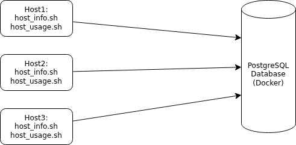

# Linux Cluster Monitoring Agent


- [Introduction](#introduction)
- [Quick Start](#quick-start)
- [Implementation](#implementation)
  - [Architecture](#architecture)
  - [Scripts](#scripts)
  - [Database Modeling](#database-modeling)
- [Test](#test)
- [Deployment](#deployment)
- [Improvements](#improvements)

# Introduction
This project implements a lightweight server monitoring solution using Bash scripts, Docker, and PostgreSQL. The goal is to collect hardware details and live resource usage from Linux machines and then store that data in a PostgreSQL database for analysis. This system is built for developers who need a lightweight and reliable method to monitor server performance across clusters. Docker is used to run a PostgreSQL instance that is easy to set up on any machine. Bash scripts act as agents that collect CPU activity, memory usage, disk information and basic host details. Git is used to manage the source code, and crontab is used to schedule the script that records server usage every minute. With scheduled data collection and a clear schema, this setup becomes a helpful base for tracking performance, spotting issues early and planning future upgrades.

# Quick Start
## 1. Start a psql instance using psql_docker.sh
### Create the container
```
./scripts/psql_docker.sh create db_username db_password
```

### Start the `container`
```
./scripts/psql_docker.sh start
```

## 2. Create tables using `ddl.sql`
```
psql -h localhost -U postgres -d host_agent -f sql/ddl.sql
```

## 3. Insert hardware specs data into the DB using `host_info.sh`
```
./scripts/host_info.sh psql_host psql_port db_name psql_user psql_password
```


## 4. Insert hardware usage data into the DB using `host_usage.sh`
```
./scripts/host_usage.sh psql_host psql_port db_name psql_user psql_password
```


## 5. Crontab setup

### Set up crontab to run `host_usage.sh` every minute
```
crontab -e
```
### add this line
```
* * * * * bash /home/rocky/dev/jarvis_data_eng_EbrahimAzarbar/linux_sql/scripts/host_usage.sh localhost 5432 host_agent postgres postgres &> /tmp/host_usage.log
```


# Implementation
## Architecture

## Scripts

This project includes several Bash scripts that automate container setup, data collection, and scheduling. Each script has a specific role in the monitoring workflow.

### `psql_docker.sh`
Script for creating, starting, and stopping the PostgreSQL Docker container.

**Usage:**
```
./scripts/psql_docker.sh create db_username db_password
./scripts/psql_docker.sh start
./scripts/psql_docker.sh stop
```

### `host_info.sh`
Collects hardware details from the host and stores them in the database.

**Usage:**
```
./scripts/host_info.sh psql_host psql_port db_name psql_user psql_password
```
### `host_usage.sh`
Collects live system usage data and saves it to the database.

**Usage:**
```
./scripts/host_usage.sh psql_host psql_port db_name psql_user psql_password
```

### `Crontab`
Crontab is used to schedule continuous resource collection across the cluster.

**Usage:**
```
* * * * * bash /home/rocky/dev/jarvis_data_eng_EbrahimAzarbar/linux_sql/scripts/host_usage.sh localhost 5432 host_agent postgres postgres &> /tmp/host_usage.log
```

### `queries.sql`
Contains SQL queries used to answer business questions such as CPU usage, memory trends, and disk availability across the hosts.


## Database Modeling


### `host_info`

| Column          | Type      | Description                              |
|-----------------|-----------|------------------------------------------|
| id              | SERIAL    | Primary key that identifies each host      |
| hostname        | VARCHAR   | Name of the host machine                          |
| cpu_number      | INT2      | Number of CPU cores                      |
| cpu_architecture| VARCHAR   | The CPU architecture                       |
| cpu_model       | VARCHAR   | The CPU model name                           |
| cpu_mhz         | FLOAT8    | CPU clock speed in MHz                   |
| l2_cache        | INT4      | L2 cache size                             |
| timestamp       | TIMESTAMP | Time of hardware info                    |
| total_mem       | INT4      | Total memory available                   |


### `host_usage`

| Column          | Type      | Description                                   |
|-----------------|-----------|-----------------------------------------------|
| timestamp       | TIMESTAMP | Time the usage data was collected             |
| host_id         | SERIAL    | References `host_info.id`                     |
| memory_free     | INT4      | Free memory at the time of collection       |
| cpu_idle        | INT2      | CPU idle percentage                              |
| cpu_kernel      | INT2      | CPU time spent on kernel processes               |
| disk_io         | INT4      | Total disk I/O operations recorded               |
| disk_available  | INT4      | Available disk space on the system          |


# Test
To make sure everything was working, I tested each part of the setup step by step:

1. **Docker + PostgreSQL**
   - After running `psql_docker.sh`, I verified the container existed using `docker ps -a`.
   - Then I started it and connected to it to confirm the database was reachable.

2. **DDL (ddl.sql)**
   - I ran the DDL file and confirmed both tables were created by checking the database with `SELECT` queries.

3. **Testing `host_info.sh`**
   - Ran the script, then checked the `host_info` table with `SELECT * FROM host_info;`.

4. **Testing `host_usage.sh`**
   - Ran the script manually and checked `host_usage` with a quick `SELECT`.

5. **Crontab**
   - Enabled the cron job, waited a few minutes, and confirmed new rows were inserted by checking the table again.

**Result:**  
All scripts worked as expected, the database accepted the data correctly, and the automated collection via cron was functional.

# Deployment
The project is deployed using Docker, GitHub, and crontab.

- **GitHub** stores all the project files and scripts. I followed a Git workflow where each task was developed in its own feature branch, then merged into `develop`, and finally into `main` through pull requests. This kept the project organized and made changes easy to review.
- **Docker** is used to containerize and create the PostgreSQL database so it can run consistently on any machine.
- **Crontab** handles the automation by running `host_usage.sh` every minute to collect and insert usage data.

Overall, this setup makes the monitoring system easy to install, update, and run on any Linux host.


# Improvements
 
- Update the cron schedule so usage is collected weekly instead of every minute. Running it every minute is unnecessary for most cases and can create extra load.
- Add basic alerts, like a warning when a server is low on memory or disk space.
- Add a cleanup script to remove old data so the database does not grow forever and stays lightweight.

