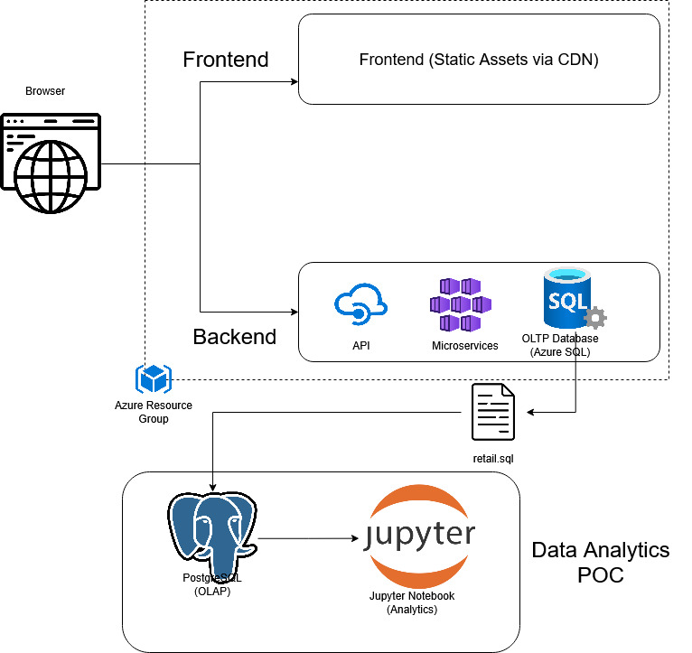

# Introduction

This project analyzes historical retail transaction data for LGS to better understand customer purchasing behavior and overall sales trends. In a competitive retail environment, insights into when customers buy, how frequently they return, and how much they spend are essential for improving revenue, retention, and marketing strategies. The dataset consists of raw transactional records that required cleaning and transformation before analysis.

The results of this analysis enable LGS to make data-driven decisions by identifying seasonal trends, customer segments, and purchasing patterns. Techniques such as RFM (Recency, Frequency, Monetary) analysis help distinguish high-value customers from inactive ones, allowing LGS to optimize promotions, improve customer retention, and plan inventory more effectively.

The work was completed using Jupyter Notebook and Python, with libraries including Pandas, NumPy, and Matplotlib. The project follows a data-warehouse mindset, transforming transactional (OLTP-style) data into aggregated, analytics-ready structures (OLAP-style) to support trend analysis and customer segmentation.

# Implementaion
## Project Architecture

This proof-of-concept (PoC) project analyzes customer shopping behavior for the London Gift Shop (LGS) without direct access to the production cloud environment. LGS operates a cloud-based online store where customers interact with a web application backed by APIs and an OLTP database that stores transactional data.

For this PoC, LGS provided a sanitized SQL dump containing historical transaction data extracted from the OLTP system, with all personal information removed. The Jarvis team performed all analysis outside the LGS Azure environment.

The SQL data was loaded into a local PostgreSQL database acting as an analytical data warehouse (OLAP) and analyzed using Python and Jupyter Notebook. The architecture follows a clear OLTP-to-OLAP separation, transforming raw transactional data into aggregated, analytics-ready datasets to support trend analysis, customer segmentation, and marketing insights for the LGS team.

## Project Architecture Diagram

## Data Analytics and Wrangling

The data analytics and wrangling work for this project was performed using Jupyter Notebook and Python.
The notebook contains the full data cleaning, transformation, exploratory analysis, and customer segmentation logic used in this PoC.

[Retail Data Analytics and Wrangling Notebook](./retail_data_analytics_wrangling.ipynb)

Using the insights generated from this analysis, LGS can take several data driven actions to increase revenue.
Customer segmentation results such as RFM analysis can be used to identify high value and loyal customers and target them with personalized promotions, loyalty programs, and early access offers.
Seasonal sales trends and purchasing patterns help determine the best timing for discounts and marketing campaigns to improve conversion rates.

Identifying inactive or low frequency customers allows LGS to design re engagement campaigns such as targeted email promotions or limited time discounts to encourage repeat purchases.
By combining customer behavior insights with pricing and product level trends, LGS can improve marketing efficiency, customer retention, and overall revenue growth.

# Improvements

If more time were available, the following improvements could be made to extend this project:

1. Automate the data ingestion and transformation process by building a scheduled ETL pipeline instead of relying on a manual SQL file import.
2. Include more contextual analysis to identify when sales or promotions occurred in each country and better explain regional differences in sales performance.
3. Create automated and interactive dashboards using a visualization tool so that cleaned and aggregated data can be refreshed and visualized automatically. This would allow the LGS marketing team to explore trends and customer segments without relying on Jupyter notebooks.
